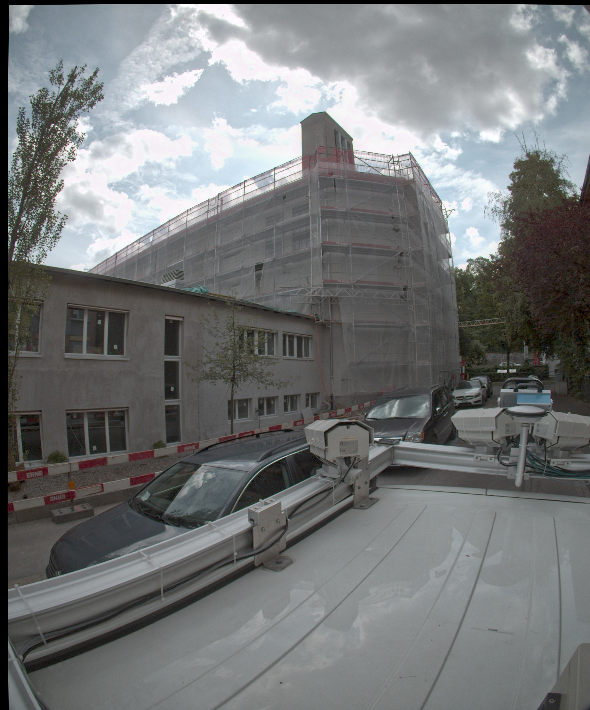

# Titile 1
## 1.1
## 1.2
### 1.1.1
### 1.1.2
### 1.2.1

### Heading level 3
#### Heading level 4
##### Heading level 5
###### Heading level 6 

----------------------------

This is a paragraph 

This is second paragraph


This is fisrt line  
This is second line

first  
second

**emphasis**  
*Italic*

> Dorothy followed her through many of the beautiful rooms in her castle.
>
>> The Witch bade her clean the pots and kettles and sweep the floor and keep the fire fed with wood.

1. First item
   1. intented item
   2. intented item
2. Second item
3. Third item

  

* First item
  * intended item
  * ittended item  
    
    this is a paragraph  
    > this is a block quote  

## code
```javascript
   // this is a comment
   var str = 10

    console.log('this is javascript code')
```  

```html
    <head>
    <title>Test</title>
    </head>
```

```python
    str = 'hello world'
    num = 1+1
    print(str)
    print('this is python code')
```

----------------------------

* Second item
* Third item

1. First item
2. Second item
3. Third item
    - Indented item
    - Indented item
4. Fourth item
   
----------------------------

`str definition funciotn `  

\*
\`
\\
\\\

-------

[github webisite](https://github.com/luoyaxiong)


<yaxiong.luo@epfl.ch>

[`code`](##code)



<p>italic and **bold**</p> 